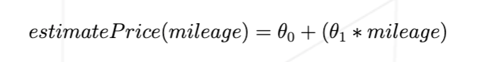
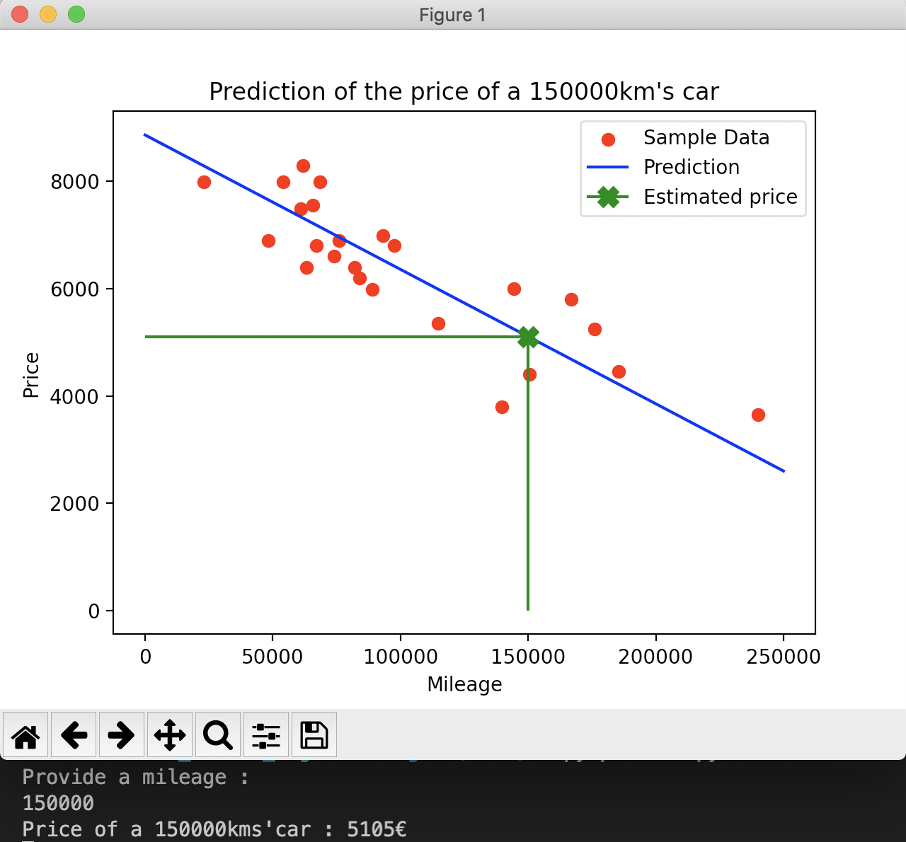

# ft_linear_regression

This is the first project of the Machine Learning branch of 42

The goal is to use the linear regression method to train our model.
It will find to appropriate value for our parameters θ0 and θ1.

It will then be able to estimate the cost of a car depending on its mileage.

### Topics : 
- supervised learning
- normalization
- cost function
- gradient descent
- linear regression
